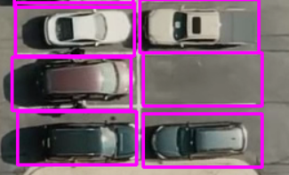

# Parking Space Counter

- ParkingSpacePicker.py
    
    1- First select and deselect parking spaces and put them all in a list
    
    For this reason, we created posList[]. When we select the point on image, it has only 2 points (x, y)
    
    1.1- We add weight and height to our points to draw a rectangle.
    
    
    
    At the end of the day, we knew all of the parking spaces and saved them on a pickle file, as well as drew rectangles on them.
    

---

- main.py
    
    Open the pickle file which we create on ParkingSpacePicker.py.
    
    We need to tell whether this region has a car present or not.
    
    1-We can do that by looking at its pixel count, 
    
    2-Convert this image into a binary image based on its edges and corners
    
    And then from there we can say that; 
    
    If it doesnt have a lot of edges or corners, then it means there is no car.
    
    
    
    We applied the dilated as the last step when converting the image to binary format.
    
    
    

We need to count the pixels from the dilated image and how many pixels each of these car spaces has.

```
# if count < 800 then color is green = empty,
# otherwise parkspace is not empty = red
```

We also include "spaceCounter," which counts empty spaces and already knows how many parking spaces are available from the pickle file.

